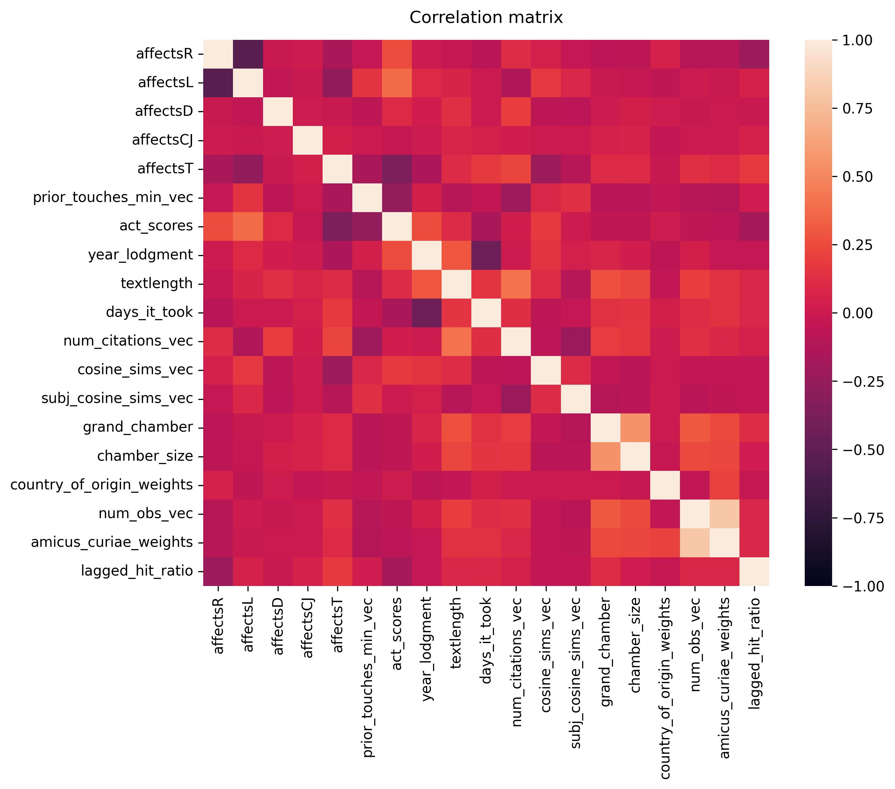
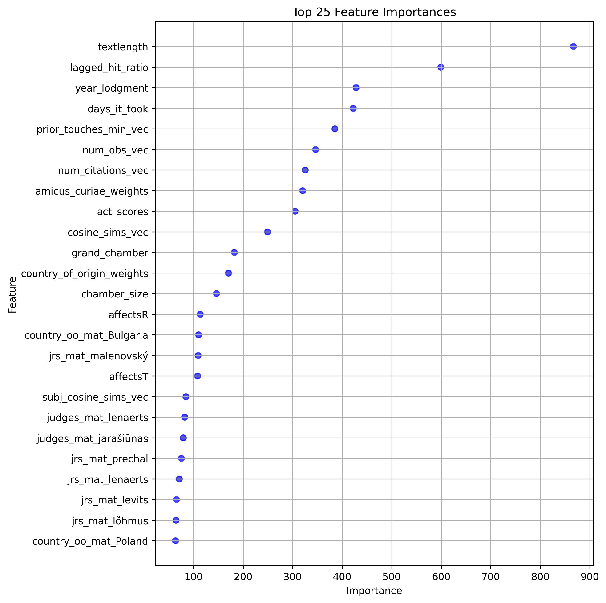

# Machine Learning from Precedent

Precedent refers to a legal principle or rule established in a previous case that is either binding or persuasive for judges deciding similar issues in future cases. While international courts do not adhere to precedent strictly speaking, they do cite previous judgments in an effort to build consistent case-law over time (Lupu and Voeten 2012). Precedential value can be seen as the influence or authority of a judgment for future case law building. 

In this project, I draw on the powers of machine learning and natural language processing (NLP) in order to process large quantities of legal documents (both judgment texts and EU laws) and thereby look into the factors behind precedential value. A variety of machine learning frameworks (Linear Regression, Support Vector Machine, Random Forest, XGBoost) are applied to the problem. By way of concluding, potentials and limitations of the machine learning framework are discussed. 

Keywords: **Machine Learning**, **scikit-learn**, **support vector machine**, **random forest**, **XGBoost**, **NLP**

## Descriptives

The problem definition is to predict the number of citations for a given judgment over the next 3 years as a function of a feature matrix. That matrix collects (1) features that relate to legal substance at stake, (2) features that relate to how the judgment is crafted, (3) features of the court, and (4) features of the (political) context. 

<table border="1" class="dataframe">
  <thead>
    <tr style="text-align: right;">
      <th></th>
      <th>count</th>
      <th>mean</th>
      <th>std</th>
      <th>min</th>
      <th>max</th>
    </tr>
  </thead>
  <tbody>
    <tr>
      <th>affectsR</th>
      <td>5310</td>
      <td>0.29</td>
      <td>0.46</td>
      <td>0.00</td>
      <td>1.00</td>
    </tr>
    <tr>
      <th>affectsL</th>
      <td>5310</td>
      <td>0.51</td>
      <td>0.50</td>
      <td>0.00</td>
      <td>1.00</td>
    </tr>
    <tr>
      <th>affectsD</th>
      <td>5310</td>
      <td>0.02</td>
      <td>0.14</td>
      <td>0.00</td>
      <td>1.00</td>
    </tr>
    <tr>
      <th>affectsCJ</th>
      <td>5310</td>
      <td>0.01</td>
      <td>0.10</td>
      <td>0.00</td>
      <td>1.00</td>
    </tr>
    <tr>
      <th>affectsT</th>
      <td>5310</td>
      <td>0.20</td>
      <td>0.40</td>
      <td>0.00</td>
      <td>1.00</td>
    </tr>
    <tr>
      <th>prior_touches_min_vec</th>
      <td>5310</td>
      <td>33.81</td>
      <td>71.43</td>
      <td>0.00</td>
      <td>408.00</td>
    </tr>
    <tr>
      <th>act_scores</th>
      <td>5310</td>
      <td>-0.06</td>
      <td>0.71</td>
      <td>-1.00</td>
      <td>1.59</td>
    </tr>
    <tr>
      <th>year_lodgment</th>
      <td>5310</td>
      <td>2009.01</td>
      <td>7.05</td>
      <td>1995.00</td>
      <td>2019.00</td>
    </tr>
    <tr>
      <th>textlength</th>
      <td>5286</td>
      <td>6888.59</td>
      <td>3545.02</td>
      <td>1.00</td>
      <td>53818.00</td>
    </tr>
    <tr>
      <th>days_it_took</th>
      <td>5310</td>
      <td>581.72</td>
      <td>184.14</td>
      <td>40.00</td>
      <td>2056.00</td>
    </tr>
    <tr>
      <th>num_citations_vec</th>
      <td>5310</td>
      <td>4.04</td>
      <td>3.27</td>
      <td>0.00</td>
      <td>47.00</td>
    </tr>
    <tr>
      <th>cosine_sims_vec</th>
      <td>5310</td>
      <td>0.78</td>
      <td>0.13</td>
      <td>0.40</td>
      <td>1.99</td>
    </tr>
    <tr>
      <th>subj_cosine_sims_vec</th>
      <td>5310</td>
      <td>0.98</td>
      <td>0.07</td>
      <td>0.08</td>
      <td>2.00</td>
    </tr>
    <tr>
      <th>grand_chamber</th>
      <td>5310</td>
      <td>0.09</td>
      <td>0.29</td>
      <td>0.00</td>
      <td>1.00</td>
    </tr>
    <tr>
      <th>chamber_size</th>
      <td>5310</td>
      <td>3.82</td>
      <td>2.62</td>
      <td>0.00</td>
      <td>22.00</td>
    </tr>
    <tr>
      <th>country_of_origin_weights</th>
      <td>5310</td>
      <td>0.07</td>
      <td>0.06</td>
      <td>0.00</td>
      <td>0.17</td>
    </tr>
    <tr>
      <th>num_obs_vec</th>
      <td>5310</td>
      <td>2.04</td>
      <td>1.76</td>
      <td>0.00</td>
      <td>15.00</td>
    </tr>
    <tr>
      <th>amicus_curiae_weights</th>
      <td>5310</td>
      <td>0.13</td>
      <td>0.12</td>
      <td>0.00</td>
      <td>0.74</td>
    </tr>
    <tr>
      <th>lagged_hit_ratio</th>
      <td>5310</td>
      <td>0.00</td>
      <td>0.00</td>
      <td>0.00</td>
      <td>0.01</td>
    </tr>
  </tbody>
</table>

The following plot visualizes the bivariate correlations among these features.

## Analysis

|Algorithm           | RMSE  | Error Reduction RMSE  | MAE     | Error Reduction MAE |
|--------------------|-------|-----------------------|---------|---------------------|
| E[y]               | 3.12  | (benchmark)           | 1.96    | (benchmark)         |
| SVM                | 2.22  | 28.9%                 | 1.24    | 36.8%  |
| Linear Regression  | 2.16  | 30.8%                 | 1.23    | 37.1%  |
| Random Forest      | 2.13  | 31.8%                 | 1.22    | 37.4%  |
| XGBoost            | 2.09  | 32.9%                 | 1.21    | 37.9%  |

Feature importance is visualized in the following plot:

## Reference

Lupu, Yonatan, and Erik Voeten. "Precedent in international courts: a network analysis of case citations by the European Court of Human Rights." British Journal of Political Science 42.2 (2012): 413-439.
